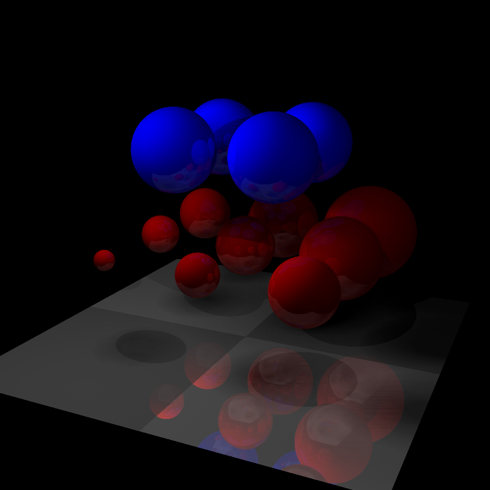

# Toy ray-tracer

JS/canvas version in top directory, Rust version in `ray` sub-directory.

Supports:
* spheres and triangles
* anti-aliasing
* point lights (hard shadows)
* sphere lights (soft shadows)
* reflections
* attenuation of lighting

The Rust version has been a bit of a playground for optimisation, check the commit log for the various things I've tried out. Blog post coming soon.

Example image:



To run the Rust version:

```
cargo run --release -- out.png
```

To run the JS/canvas version - open `ray.html` in your browser (and wait, or tweak the settings so it renders in a reasonable amount of time).
